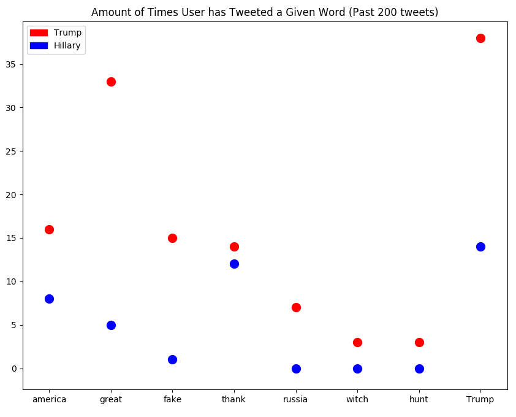
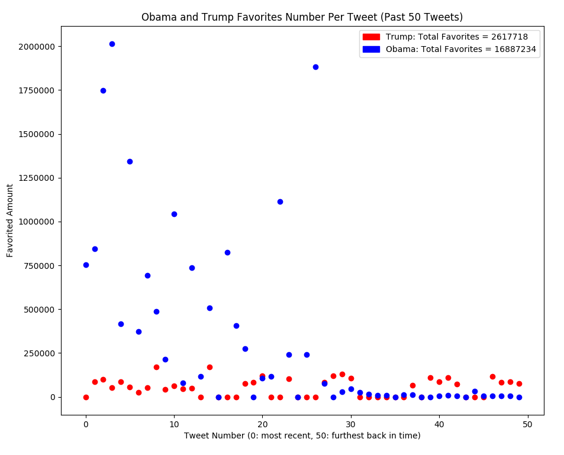

# Tweepy-Fun

## tweetedWords.py
Input any amount of words into the array "list_of_words" to find how many times Trump and Hillary have tweeted each word. Below is an example output.

## numberOfFavorites.py
#Counts how many favorites a given tweet has from given users.  Right now it looks at Trump and Obama.  Below is an example output.

